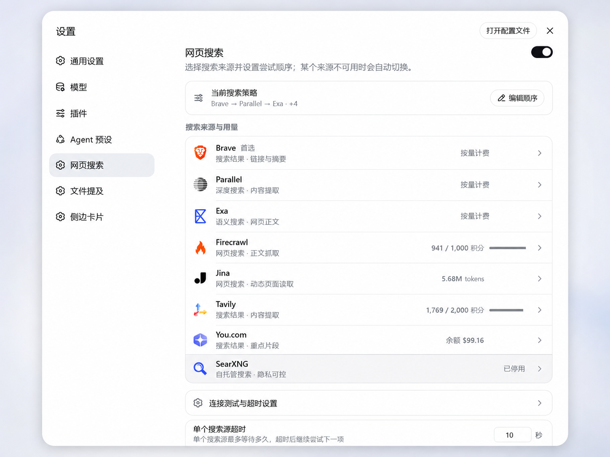
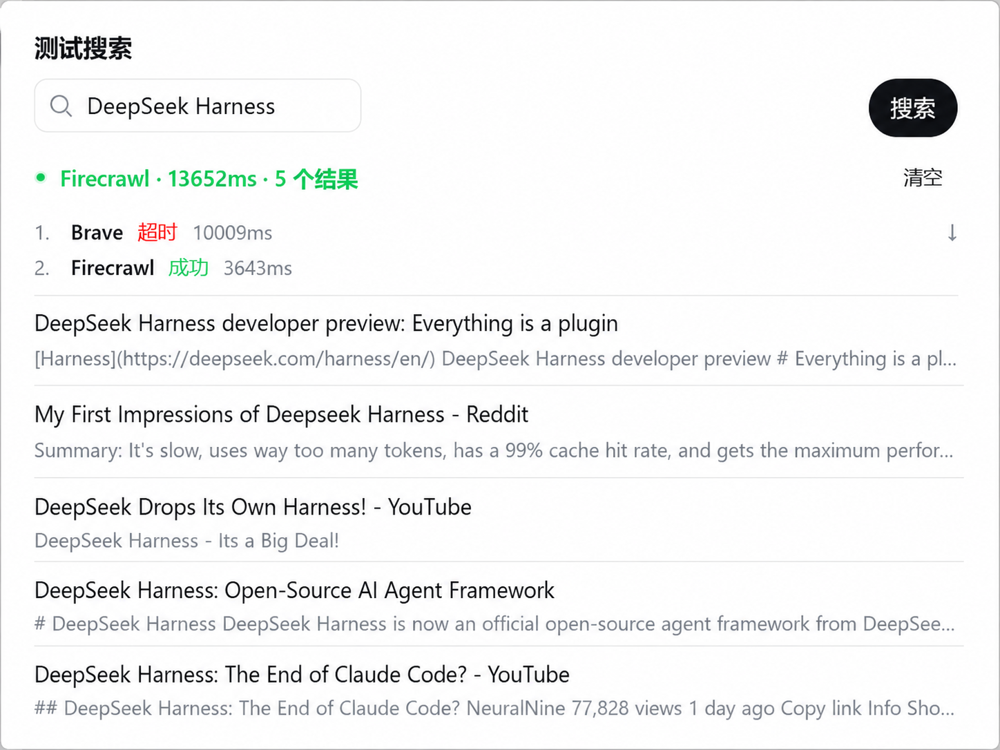
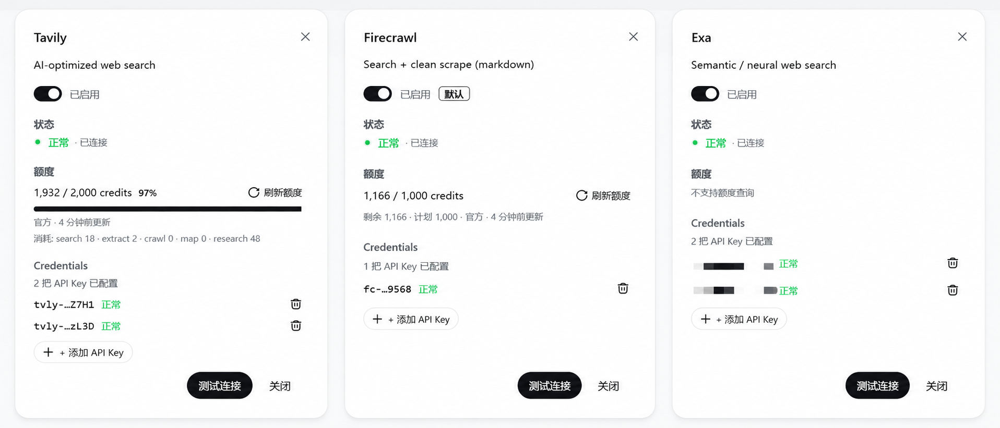
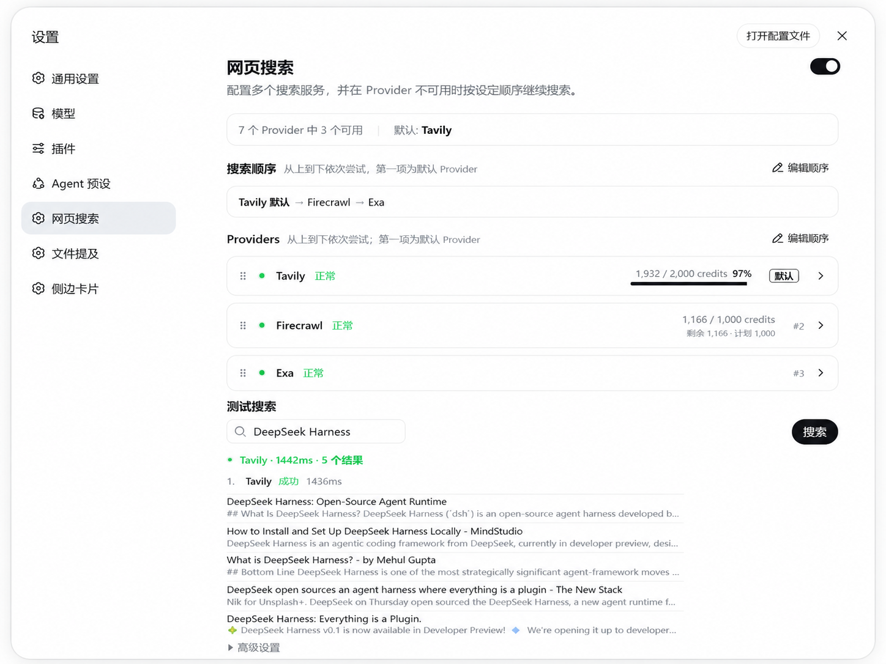
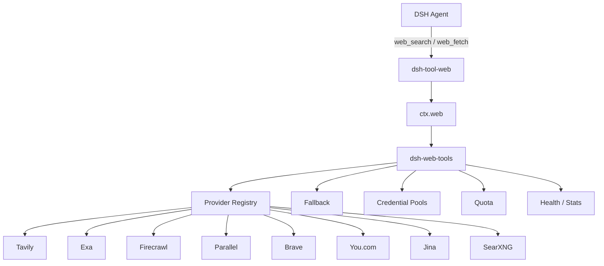
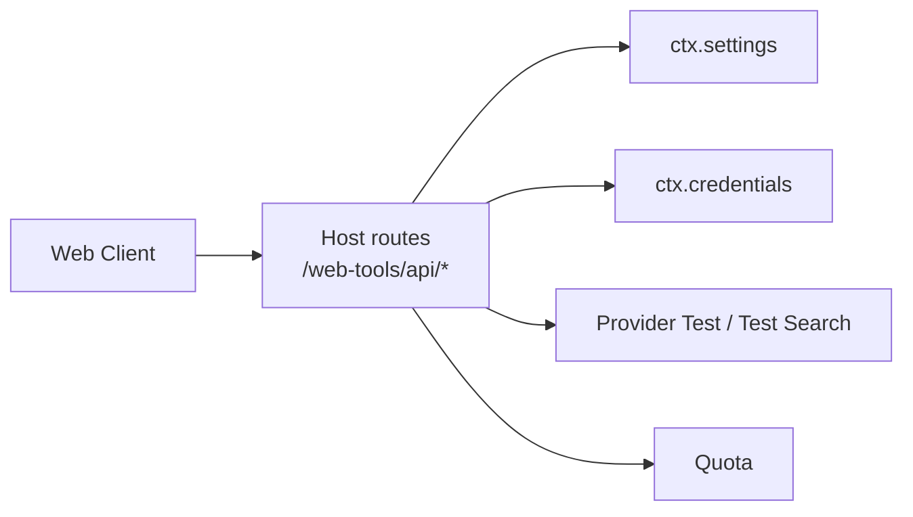

<div align="center">

<p align="center">
  
</p>

# dsh-web-tools

A multi-provider Web Search / Fetch plugin for DeepSeek Harness.

Configure Tavily, Exa, Firecrawl, Parallel, Brave, You.com, Jina, and SearXNG in one place and define the order in which they are used. When a provider is rate-limited, unavailable, times out, or has invalid credentials, the plugin can continue with the next provider in the chain.

The agent still uses the built-in `web_search` and `web_fetch` tools provided by DSH.

[](LICENSE)
[](CONTRIBUTING.md)
[](https://github.com/deepseek-ai/deepseek-harness)

**English** | [简体中文](README.zh-CN.md)

</div>

<p align="center">
  
</p>

## Features

- Tavily, Exa, Firecrawl, Parallel, Brave, You.com, Jina, and SearXNG
- Configurable provider priority and fallback order
- Multiple API keys per provider
- Provider and credential health tracking
- Balance, quota, or rate-limit information where available
- Quota refreshed **in the background** (every 5 minutes) — fresh on page open
- System proxy support (env vars / Windows system proxy; loopback auto-bypass)
- Native content fetching through Tavily, Exa, Firecrawl, Jina, and Parallel
- Self-hosted SearXNG support
- Native DSH Web settings panel
- Provider connection tests and Test Search
- Page **UI language** switchable independently (Follow system / 中文 / English) without touching the DSH-wide language
- API keys stored through DSH Credentials

The plugin does not provide a proxy service or shared API keys. Requests are sent directly from the local DSH Host to the configured provider.

## Installation

The plugin is currently developed and tested against DeepSeek Harness `0.1.0-rc.6` with the `web` profile.

```bash
dsh plugin --profile web add github:A3Boy/dsh-web-tools
```

Restart `dsh web`, then open:

```text
Settings → Web Search (top-level page)
```

Check that the plugin is part of the active profile:

```bash
dsh --profile web --dump-config
```

Update or remove it with:

```bash
dsh plugin --profile web update dsh-web-tools
dsh plugin --profile web remove dsh-web-tools
```

The plugin is loaded through the DSH Profile Bundle mechanism and does not patch the Harness source code.

> **Update not taking effect?** If a restart still shows old behavior (e.g.
> You.com 404, missing quota), the profile is likely loading a **stale
> snapshot** from install time rather than the latest code. In the profile
> directory run:
>
> ```bash
> cd ~/.dsh/profiles/web
> pnpm install
> ```
>
> If your profile links a local plugin directory with the `file:` protocol,
> switch it to `link:` — under `nodeLinker: hoisted` (pnpm-workspace.yaml)
> `file:` is a snapshot copy that never follows source changes, while `link:`
> is a symlink that updates on restart.

## Network & proxy

Node's global `fetch` does NOT read the OS proxy by default. The plugin uses a proxy in this order:

1. `HTTPS_PROXY` / `HTTP_PROXY` environment variables
2. the Windows system proxy (registry) — so a GUI-launched DSH process with no env vars still works behind a proxy

Rules:

- `localhost` / `127.0.0.1` / `::1` / `*.local` (e.g. a local SearXNG instance) NEVER go through the proxy
- `NO_PROXY` entries — exact hosts, `.suffix` domains, `<local>` — bypass the proxy
- If a proxy is configured but `undici` (the proxy dependency) is missing — typical for a profile linked before the dependency was declared — requests **degrade to direct fetch** and the Settings page shows a "Proxy unavailable" banner; proxy-dependent providers may time out. Run `pnpm install` in the profile directory and restart to fix.

## Providers

| Provider | Search | Fetch | Best for |
| --- | :---: | :---: | --- |
| [Tavily](https://tavily.com) | ✅ | ✅ | General agent search and content extraction |
| [Exa](https://exa.ai) | ✅ | ✅ | Semantic search, research, and highlights |
| [Firecrawl](https://firecrawl.dev) | ✅ | ✅ | Search followed by scraping or page extraction |
| [Parallel](https://parallel.ai) | ✅ | ✅ | Agent-native search + extract (LLM-ranked compressed excerpts) |
| [Brave Search](https://brave.com/search/api/) | ✅ | — | General-purpose Web search |
| [You.com](https://you.com) | ✅ | — | Web and News search |
| [Jina](https://jina.ai) | ✅ | ✅ | Search plus LLM-friendly page reading |
| [SearXNG](https://docs.searxng.org) | ✅ | — | Self-hosted metasearch |

A rough starting point:

| Use case | Try |
| --- | --- |
| General agent search | Tavily |
| Semantic search / technical research | Exa |
| Search followed by page extraction | Firecrawl / Jina / Parallel |
| Traditional Web search | Brave |
| Web / News search | You.com |
| Self-hosted search | SearXNG |

<details>
<summary><strong>Free tier and pricing reference</strong> (2026-08-16)</summary>

This table is provided for comparison only. Pricing and free tiers are controlled by the upstream providers and may change.

| Provider | Current free tier | Notes |
| --- | --- | --- |
| Tavily | 1,000 credits / month | Basic Search = 1 credit |
| Exa | $20 signup credits, then $10 / month | Search currently $7 / 1k requests |
| Firecrawl | 1,000 credits / month | Search = 2 credits / 10 results |
| Brave | $5 credits / month | Search currently $5 / 1k requests |
| You.com | $100 signup credits | Current site also lists 100 Search calls/day free |
| Jina | 10M tokens for a new API key | `s.jina.ai` is token-based; no-key is blocked, free key = 100 RPM |
| Parallel | Pay-as-you-go (no free tier entry) | Search $5 / 1k requests (default 10 results, extra billed separately); Extract $1 / 1k URLs; usage in the Parallel Platform |
| SearXNG | No platform quota | Cost depends on your instance and upstream engines |

</details>

## Search priority

The Settings page manages one ordered provider list:

```text
1. Tavily        Default
2. Exa
3. Brave
4. SearXNG
```

The first provider is the default. The remaining providers are tried in order when fallback is needed.

Providers can be:

- moved up or down
- added to the search chain
- removed from the search chain
- enabled or disabled independently

Removing a provider from the search chain does not disable it. A configured provider can remain available for manual testing without participating in automatic fallback.

For example:

```text
Tavily
  ↓ 429
Exa
  ↓ timeout
Brave
  ↓
success
```

Real fallback in Test Search:

<p align="center">
  
</p>

The following failures currently allow the search to continue with another provider:

```text
401 / 403
408
429
5xx
network error
timeout
provider unavailable
```

For authentication failures, the plugin first tries another healthy key from the same provider. If no usable key remains, it moves on to the next provider.

`400 bad request` and local configuration errors do not trigger fallback.

If the caller aborts the request, the entire chain stops immediately.

## Multiple API keys

Each provider can be configured with more than one API key:

```text
Tavily
├── Key A
├── Key B
└── Key C
```

Keys use a least-used-first policy:

1. Select the healthy key with the lowest usage count.
2. Break ties using the configured key order.
3. `401 / 403` marks the current key as unhealthy and tries the next key.
4. `429 / 5xx / network / timeout` does not mark the key as invalid; fallback proceeds to the next provider instead.
5. Key health is preserved until the configured credential value changes.

Multiple keys may be separated by commas, spaces, newlines, or semicolons.

This feature is intended for team credentials, separate workspaces, key rollover, and environment separation. Follow the account and quota policies of each provider.

## Quota information

Providers expose usage in different units:

```text
Tavily      credits
Firecrawl   credits
Parallel    pay-as-you-go
Brave       requests
You.com     USD
Jina        tokens
SearXNG     self-hosted
```

The plugin keeps the upstream unit instead of converting everything into a percentage.

| Provider | Source | Status |
| --- | --- | --- |
| Tavily | Official `/usage` endpoint | ✅ |
| Firecrawl | Official `/v2/team/credit-usage` endpoint | ✅ |
| You.com | Official Account Balance API (`X-API-Key`) | ✅ |
| Brave | `X-RateLimit-*` response headers (persisted) | ✅ |
| Exa | No public balance endpoint for a normal Search key | Local estimate |
| Jina | Balance information returned by Reader | Best-effort |
| Parallel | Usage and spend live in the Parallel Platform dashboard | Dashboard only |
| SearXNG | No platform quota | Self-hosted |

Quota snapshots are classified as authoritative or best-effort and are currently used for display in the Settings panel.

Search fallback is driven by real request failures such as `402`, `429`, and provider errors. Failure to retrieve quota information does not affect Search.

For providers using multiple keys, the quota panel queries every key and merges the results into a single pool total (remaining / limit summed).

Quota is refreshed **in the background**: the plugin re-pulls snapshots every 5 minutes without needing the Settings page open (and shortly after startup), so a freshly booted profile already shows fresh balances.

Brave has no quota endpoint — its only quota signal is the `X-RateLimit-*` header captured during a real search. Those snapshots are **persisted to settings**, so a restart keeps showing the last known remaining requests until the next search refreshes them.

On pay-as-you-go plans (e.g. $5/1k) the header reads `X-RateLimit-Limit: 1, 0` — a monthly window of 0 means **no fixed monthly quota** (pay per use), shown as "Pay-as-you-go · no monthly cap".

Quota snapshots as shown in the Settings panel:

<p align="center">
  
</p>

## Web fetching

A typical flow is:

```text
web_search
    ↓
candidate URL
    ↓
web_fetch
    ↓
page content
```

Tavily, Exa, Firecrawl, Jina, and Parallel use their native content extraction APIs.

`web_fetch` follows the same provider priority list and looks for the next provider that supports Fetch. It does not stay bound to the provider that handled the previous `web_search`.

For example:

```text
Brave Search
    ↓
URL
    ↓
Tavily / Exa / Firecrawl / Jina / Parallel Fetch
```

There is an important semantic difference here: provider-native Extract / Reader APIs mainly return page content. The plugin therefore cannot always provide the real upstream HTTP status code, final redirect URL, or other strict HTTP fetch metadata.

For workloads that require strict HTTP Fetch semantics, use the HTTP Fetch implementation provided by DSH and treat this plugin's Fetch support as content extraction.

## Settings

Open:

```text
Settings → Web Search (top-level page)
```

The panel currently manages:

- plugin enabled state
- provider priority
- per-provider attempt timeout
- provider enable / disable state
- API keys / multiple keys
- custom Base URLs
- provider connection tests
- quota information
- Test Search

Test Search performs a real search and shows the provider used, request latency, and returned results:

<p align="center">
  
</p>

The result count is still controlled by the DSH `web_search` tool layer.

DSH also owns the overall timeout for a complete `web_search` call. The timeout configured here only limits one provider attempt before fallback proceeds.

## UI language

The top-right corner of the page has a **UI language** selector: **Follow system / 中文 / English**.

- Default **Follow system**: tracks the DSH-wide language (Settings → General → Language); the page follows automatically when DSH switches
- Choosing **中文** or **English**: forces only this page to that language — it does **not** change the DSH-wide language or affect other plugins
- The choice persists in the plugin's own config and survives restarts

## SearXNG

SearXNG can be placed anywhere in the search order:

```text
Tavily → Exa → Brave → SearXNG
```

It can also be used as the only configured provider.

SearXNG is **keyless**: instead of an API key, set the instance Base URL in the
provider dialog. No key is needed for it to work.

SearXNG itself has no cloud API quota, but reliability and result quality still depend on your instance, network connection, and enabled upstream engines.

## Security

- API keys are resolved only on the DSH Host.
- Full credentials are never returned to the Web Client.
- The client receives only configuration state or masked credential information.
- Test results and logs do not include full API keys.
- Configuration writes are restricted to the local configuration surface.
- Requests do not pass through a server operated by this project.
- The plugin does not upload Search usage telemetry.
- A fully self-hosted setup using only SearXNG is supported.

## Compatibility and known limitations

- Currently developed and tested against DeepSeek Harness `0.1.0-rc.6`. DSH is still in developer preview, so future versions may require compatibility changes.
- Provider-native Extract / Reader APIs are not equivalent to strict HTTP Fetch.
- SearXNG result quality and reliability depend on the instance and enabled upstream engines.
- Provider pricing and free tiers are controlled by upstream services and may change.
- Parallel usage and spend are only viewable in the Parallel Platform dashboard; there is no balance API.
- For multi-key providers the quota panel merges every key into a pool total; per-key detail is not shown individually.

## Architecture



The Web settings panel communicates with local Host routes:



Provider selection and fallback happen inside the plugin. No additional LLM call is required, and the plugin does not register a separate model-visible tool for each provider.

## Verification

| Check | Status |
| --- | --- |
| TypeScript / Build | ✅ |
| Pool / fallback / Jina / Brave-header unit tests | ✅ |
| Config / credential / quota / loopback route smoke tests | ✅ |
| Abort / timeout / auth / multi-key runtime invariants | ✅ |
| Tavily Search + Quota | ✅ E2E |
| Exa Search + multiple keys | ✅ E2E |
| Firecrawl Search + Fetch + Quota | ✅ E2E |
| You.com Search + Quota (`X-API-Key`) | ✅ E2E |
| Brave Search + header quota | ✅ E2E |
| Parallel Search + Extract | Adapter ready, unit tests ✅, E2E pending API key |
| Jina / SearXNG | Adapter ready, E2E pending |

Run the test suite:

```bash
npm install
npm test
```

Run type checking and build separately:

```bash
npx tsc -p tsconfig.json --noEmit
npx tsc -p tsconfig.client.json --noEmit
npx tsc -p tsconfig.build.json
npm run build
```

> The compiled `lib/` is committed to the repository on purpose: DSH installs
> plugins from git through pnpm, which blocks dependency build scripts until
> approved, so a fresh checkout must already contain the bundle. Rebuild with
> `npm run build` and commit `lib/` alongside source changes.

## Provider development

Provider adapters live in:

```text
src/host/providers/
```

A new provider implements the `ProviderAdapter` contract and is registered in the provider registry.

If the provider also exposes content extraction or quota information, it can supply Fetch and Quota implementations as well.

See [CONTRIBUTING.md](CONTRIBUTING.md) for the current conventions.

## Roadmap

- Serper
- Parallel
- Perplexity
- More provider E2E coverage
- Provider result comparison
- Usage history
- Evaluate moving `web_fetch` back to strict DSH HTTP Fetch semantics

## Install with a coding agent

<details>
<summary>Installation prompt</summary>

```text
Install dsh-web-tools:

https://github.com/A3Boy/dsh-web-tools

Requirements:
- Use the standard plugin installation flow for the current DSH profile.
- Do not read or print API keys.
- Do not modify DeepSeek Harness core.
- After installation, run `dsh --profile web --dump-config` to verify the profile.
- Do not terminate or restart an existing DSH process without asking me first.
- Report whether the plugin is present in the web profile.
```

</details>

## Contributing

Issues and pull requests are welcome.

Before adding a provider, check the existing adapters and [CONTRIBUTING.md](CONTRIBUTING.md). Avoid adding provider-specific model tools unless there is a strong reason to do so.

## License

[MIT](LICENSE) © A3Boy
