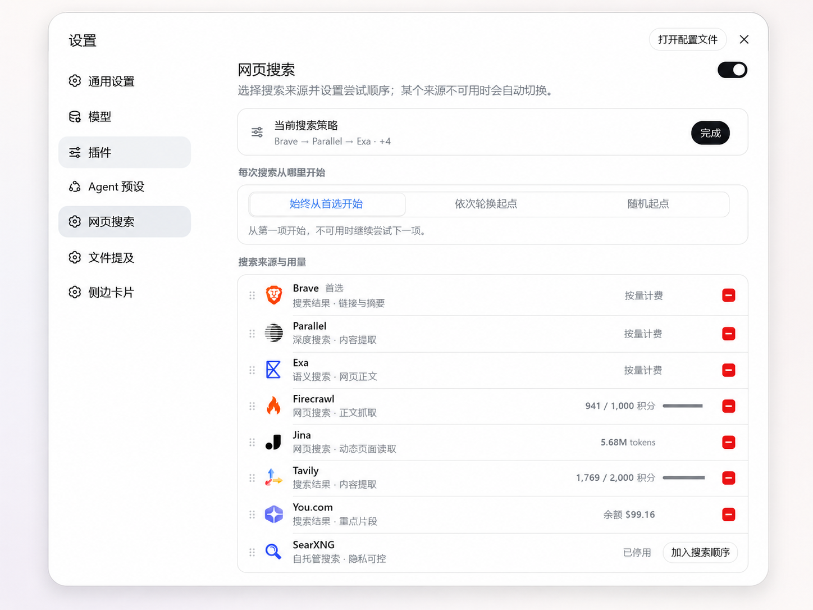
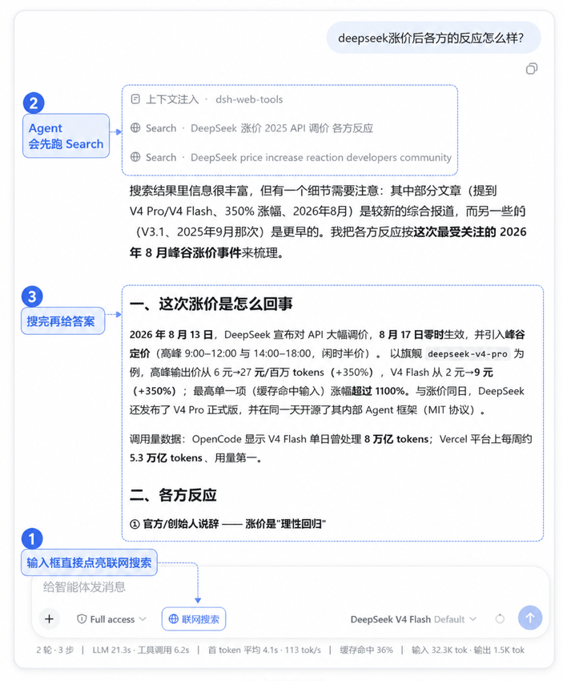

<div align="center">

<p align="center">
  
</p>

# dsh-web-tools

让 DeepSeek Harness 拥有直连全网与社媒平台的搜索与抓取能力。

✨ **核心亮点**：
- 🔍 **全网聚合与自动容灾**：9+ 主流搜索源（Exa、Tavily、Brave、Firecrawl、Parallel、SearXNG 等）无缝聚合，首选源故障秒级平滑降级。
- 📱 **小红书与 Twitter(X) 原生搜索**：深度融合社媒平台原生搜索与图文/推文详情抓取，保留 `xsec_token` 与时间筛选。
- 🛡️ **原生独立会话架构**：基于本机已安装 Edge/Chrome 独立 Profile 与 CDP 交互，**0 扩展依赖、0 Playwright/Chromium 打包、0 Cookie 存储泄露**。
- ⚡ **无感融入 Agent**：全自动适配 DSH 原生 `web_search` / `web_fetch`，智能意图路由，开箱即用。

<p align="center">
  <a href="https://github.com/A3Boy/dsh-web-tools/stargazers">
    
  </a>
  <a href="LICENSE">
    
  </a>
  <a href="https://github.com/deepseek-ai/deepseek-harness">
    
  </a>
  
</p>

[English](README.md) | **简体中文**

</div>

<p align="center">
  
</p>

## 特性

- **零开销 SearchHints 语义层**：内置纯代码确定性意图提取，自动从 Query 识别技术代码、论文研究、新闻时效及域名约束（如 `site:github.com`、`after:YYYY-MM-DD`），智能映射至各大 Provider 的原生参数与专属索引，不增加额外 LLM 调用延迟。
- **8 大主流搜索源深度适配**：
  - **Parallel**：双层语义优化（`objective` 软引导 + `search_queries` 纯净词）与 `source_policy` 域名/时效过滤。
  - **Firecrawl**：代码与技术查询直连 **Developer Index**（`categories: ["developer"]`），支持论文 `research` 与 `tbs` 时效过滤。
  - **Exa**：精确分类映射（`publication` / `news` / `financial report`）、ISO 日期范围与域名限制。
  - **You.com**：原生 **`boost_domains`** 软加权支持，时效与地区国家过滤。
  - **Brave Search**：LLM Context 预提取端点支持 `pd/pw/pm/py` 时效、国家与搜索语言。
  - **Tavily**：全档位 `chunks_per_source` 分块控制，`news` 话题与时间区间过滤（finance/code 智能回退通用检索）。
  - **SearXNG**：自建元搜索支持 `categories`（it/science/news）与 `time_range`。
  - **Jina**：搜索关键词降噪与 ReaderLM-v2 高精度 Markdown 正文解析。
- **平台搜索源（小红书与 Twitter / X）**：
  - **Browser Bridge 模式**：通过轻量 MV3 浏览器扩展连接用户浏览器真实登录态，**Host 端 0 保存平台 Cookie**，彻底避免逆向接口维护与风控封号。
  - **小红书**：瀑布流 DOM 增量提取，保留完整 `xsec_token` 签名 URL 并支持正文与互动数据解析。
  - **Twitter / X**：原生支持 `from:`、`since:` 等高级检索算子与语义 DOM 推文抓取。
  - **断开降级（Web Fallback）**：平台未连接时自动降级为 `site:xiaohongshu.com` / `(site:x.com OR site:twitter.com)`。
- **完全兼容 DSH 原生工具**：不增加 `web_search_exa` 等特定工具，Agent 无感调用官方标准 `web_search` 与 `web_fetch`。
- **多 Query 并发支持**：适配 DSH 原生 `queries[]` 数组，在存在多个独立检索维度时并行请求。
- **多 API Key 负载与容灾**：支持为单个 Provider 配置多个 API Key，并发调用优先分配低负载 Key，鉴权失败自动切换备用 Key。
- **确定性 Provider Fallback**：遇到网络异常、超时、5xx 服务端错误、429 限流或配额耗尽时，自动降级至链条中的下一搜索源。
- **429 Retry-After 临时冷却**：遭遇限流并携带 `Retry-After` 时触发零请求冷却，避免频繁重试造成无效请求积压。
- **搜索路由策略**：支持顺序模式（Ordered）、轮询模式（Round-Robin）、随机模式（Random）三种首选源调度方式。
- **一键搜索偏好预设**：提供 快速响应（Fast）、深度检索（Deep）、经济节省（Economy）与默认推荐，支持随时一键切换或还原。
- **原生正文提取（Extract / Scrape）**：`web_fetch` 会自动调用支持 Provider 的原生提取接口（如 Exa `/contents`、Tavily `/extract`、Firecrawl `/scrape`、Parallel `/v1/extract`、You.com `/v1/contents`、Jina Reader）。
- **会话级「联网搜索」（Search Mode）**：输入框支持快捷切换联网策略，开启后在 Agent 回复前强制先进行联网检索与验证。
- **代理与自托管支持**：完整支持系统代理、`HTTP(S)_PROXY`、`NO_PROXY` 规范以及免 API Key 的自建 SearXNG 实例。

> 本插件不提供公共中转服务或共享 API Key，所有请求均由本地 DSH Host 直接与目标 Provider 官方 API 通信。

## 安装与更新

### 安装

```bash
dsh plugin --profile web add github:A3Boy/dsh-web-tools
```

重启 `dsh web`，在左侧侧边栏进入：

```text
Settings → Web Search
```

### 更新

```bash
dsh plugin --profile web update dsh-web-tools
```

设置页会在后台静默检测 GitHub Releases 最新稳定版本，若有新版本将在界面提示更新。

### 卸载

```bash
dsh plugin --profile web remove dsh-web-tools
```

## Provider 支持矩阵

| Provider | 搜索 (Search) | 抓取/提取 (Fetch / Extract) | 核心特性与深度适配能力 | 配额查询 (Quota) |
| --- | :---: | :---: | --- | :---: |
| [Exa](https://exa.ai) | ✅ | ✅ `/contents` | 语义检索 (`auto` / `fast` / `deep` 系列)、`category` 垂直分类映射（publication / news / financial report）、Query-aware 高亮切片、ISO 日期范围与域名限制 | 控制台自查 |
| [Tavily](https://tavily.com) | ✅ | ✅ `/extract` | 深度检索 (`basic` / `advanced` / `fast` / `ultra-fast`)、全档位分块控制、`news` 话题与时间区间过滤、智能参数 | ✅ 官方 API |
| [Firecrawl](https://firecrawl.dev) | ✅ | ✅ `/scrape` | 结构化搜索、代码查询直连 **Developer Index**、`research` 分类、`tbs` 时效过滤、Clean Markdown 提取、`onlyMainContent` 过滤 | ✅ 官方 API |
| [Parallel](https://parallel.ai) | ✅ | ✅ `/v1/extract` | Agent 针对性双层语义检索 (`advanced` / `basic` / `turbo`)、`objective` 软引导、`source_policy` 域名与时效过滤、LLM 评分切片、全文提取 | 控制台自查 |
| [Brave Search](https://brave.com/search/api/) | ✅ | — | 默认优先 LLM Context 预提取模式，支持 `pd/pw/pm/py` 时效过滤与区域语言，不支持时自动回退至 Classic Web Search | ✅ 响应头自动捕获 |
| [You.com](https://you.com) | ✅ | ✅ `/v1/contents` | 搜索高亮片段提取、原生 **`boost_domains`** 软加权、时效与国家语言过滤、Markdown 正文接口 | ✅ 官方 API (USD) |
| [Jina](https://jina.ai) | ✅ | ✅ Reader | 搜索关键词降噪、ReaderLM-v2 高精度 Markdown 转换、Token 预算与截断控制 | 尽力解析 (Reader) |
| [SearXNG](https://docs.searxng.org) | ✅ | — | 开源自托管元搜索引擎，映射 `categories` (it/science/news) 与 `time_range`，无需 API Key 保护隐私 | 自建实例无限制 |

<p align="center">
  
</p>

## 插件配置与功能效果对照

| 配置项 | 所在位置 | 可选值 / 格式 | 功能效果与实际表现 |
| :--- | :--- | :--- | :--- |
| **主开关 (Enabled)** | 设置页顶部 | 开关 (Toggle) | 全局启用或停用此多源检索 Runtime，关闭后回退至 DSH 内置默认检索行为。 |
| **搜索路由策略** | 设置页顶部策略栏 | 顺序模式 / 轮询模式 / 随机模式 | **顺序**：每次均从首选源开始；**轮询**：每轮查询顺序轮换起点分摊负载；**随机**：每次随机挑一起点。失败时均自动 Fallback。 |
| **搜索源拖拽排序** | 搜索源配置列表 | 拖拽 handle (`⋮⋮`) | 自定义 Provider 的默认优先级与 Fallback 降级顺序，排在第一位者为首选源。 |
| **API 密钥池管理** | Provider 详情弹窗 | 支持添加多把 Key（脱敏显示） | 单 Provider 内部多 Key 轮询与负载均衡，并发时分配给低 `inFlight` 的 Key，遇 401 自动切备用 Key。 |
| **搜索偏好预设** | 设置页 / 偏好面板 | 推荐 / 快速 / 深度 / 节省 / 自定义 | 一键调整所有 Provider 的底层原生检索深度与提取模式（如快速响应优先 vs 深入深度检索）。 |
| **单搜索源超时时间** | 底部高级设置栏 | 1000ms – 60000ms（默认 10s） | 单个 Provider 调用的最大等待时间，超时自动中断并立即尝试下一家，避免 Agent 被慢接口卡死。 |
| **会话联网搜索 (Search Mode)** | 聊天输入框左侧 | 自动 (Auto) / 必选 (Required) | **必选**时强制 Agent 在回答前必须先调 `web_search`/`web_fetch` 进行验证，未验证需如实说明。 |
| **网络代理 (Proxy)** | 环境变量 / 系统代理 | `HTTP(S)_PROXY` / `NO_PROXY` | 自动识别环境代理，本地回环地址（`localhost`、`127.0.0.1`、SearXNG 本地实例）自动 Bypass。 |

## 快速选型指南

新安装默认首选 Provider 为 **Exa**（基于项目 P5 基准测试评估结果）。

| 需求场景 | 推荐首选 | 说明 |
| --- | --- | --- |
| 综合默认 / 技术文档检索 | **Exa** | 语义匹配度高，切片精准 |
| 低延迟 Agent 上下文召回 | **Brave Search** (LLM Context) | 检索速度快，直接返回整合片段 |
| 深度研究与结构化 Extract | **Tavily** / **Parallel** | 适合复杂问题调研与正文二次解析 |
| 高质量网页 Markdown 抓取 | **Firecrawl** / **Jina** / **You.com** | 页面主体内容清洗能力强 |
| 新闻与通用时事 | **You.com** | 新鲜度与通用 Web 覆盖度好 |
| 内部局域网 / 隐私自托管 | **SearXNG** | 无需外部 API Key，完全私有化部署 |

## 调度策略与容灾机制

### 1. 搜索路由策略 (Search Routing Policy)

可在设置页选择当前请求的首选 Provider 决定逻辑：
- **顺序模式 (Ordered - 默认)**：始终优先请求列表第一位的 Provider。
- **轮询模式 (Round-Robin)**：每轮查询依次轮换首选 Provider，均匀分摊多个 Provider 之间的请求量。
- **随机模式 (Random)**：每轮查询随机选择初始 Provider。

> 无论采用何种路由策略，当初始 Provider 失败时，均会自动沿剩余可用链路执行 Fallback。

### 2. 自动 Fallback 链路

支持拖拽调整 Provider 的 Fallback 顺序。当遇到以下异常时自动顺延至下一可用 Provider：
- 请求超时（可在设置中配置单次尝试超时时间，默认 10s）
- 网络连接中断或 DNS 解析失败
- Provider 服务端 5xx 错误
- 429 请求频次超限 / 额度耗尽（402 / 432 / 433）

### 3. 429 智能冷却 (Cooldown)

当某 Provider 返回 429 且附带 `Retry-After` 标头时，插件会自动将该 Provider 标记为冷却状态。在冷却周期结束前，后续请求将直接跳过该 Provider，不产生额外无效 HTTP 往返。

### 4. 多 API Key 轮询与并发隔离

针对单个 Provider，可添加多个 API Key：
- 并发请求优先指派当前 `inFlight` 数量最少的可用 Key。
- 遇 401/403 鉴权失败时，自动将该 Key 标记为异常并尝试同 Provider 下的其它备用 Key。
- 前端页面对 API Key 全程脱敏展示，保障凭据安全。

## 搜索模式 (Search Mode)

在 Web 对话输入框左侧提供了会话级「联网搜索」快捷开关：

- **关闭 (Auto)**：由 Agent 自主根据上下文判断是否调用联网工具。
- **开启 (Required)**：在当前轮次生成最终回答前，强制 Agent 必须先通过 `web_search` 或 `web_fetch` 获取外部信息；若检索完全失败，要求 Agent 明确说明未经验证的事实。

<p align="center">
  
</p>

## 设置页测试 (Test Search)

在设置页底部提供实测调试面板，可直接向当前配置的 Fallback 链路发送测试 Query：
- 实时反馈最终胜出的 Provider
- 展示全链路耗时与召回条数
- 显示每一次尝试的详细状态（命中成功、超时、鉴权失败、限流等）
- 预览检索结果与摘要片段

<p align="center">
  
</p>

## 代理配置

插件内置 Proxy 支持，支持以下环境变量与规则：

```text
HTTP_PROXY / HTTPS_PROXY
Windows 系统代理设置
NO_PROXY
```

本地回环地址（`localhost`、`127.0.0.1`、`::1`、`*.local`）默认自动绕过代理。

## 安全与隐私说明

- **本地存储与调用**：API Key 仅保存在本地 DSH 凭据系统，由宿主进程直接向 Provider 发起通信，无第三方服务器中转。
- **敏感数据脱敏**：Web 前端不回传完整 API Key，运行时日志及测试输出中自动过滤 Authorization 等鉴权标头。
- **自托管支持**：可搭配本地 SearXNG 实例实现完全离线的私有化元检索。

## 本地开发

```bash
# 安装依赖
pnpm install

# 运行测试套件
pnpm test

# 类型检查
pnpm run typecheck

# 编译构建
pnpm run build
```

> 修改 `src/` 下的代码后需执行 `pnpm run build` 生成 `lib/` 产物。更多开发规范请参考 [CONTRIBUTING.md](CONTRIBUTING.md)。

## 常见问题

<details>
<summary><b>更新插件重启后界面仍显示旧版本？</b></summary>

若使用 `file:` 方式或本地包升级遇到缓存问题，可前往 Profile 目录重新安装：

```bash
cd ~/.dsh/profiles/web
pnpm install
```

本地开发建议使用软链接方式（`link:`）载入。
</details>

<details>
<summary><b>为什么部分 Provider 的配额显示“控制台自查”？</b></summary>

部分服务商（如 Exa、Parallel）暂未开放轻量级的账户余额查询公开 API，配额查询属于非必要辅助功能，不影响正常检索与 Fallback。
</details>

## 许可

[MIT](LICENSE) © A3Boy
