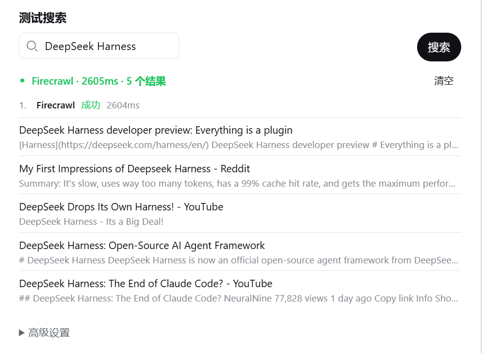
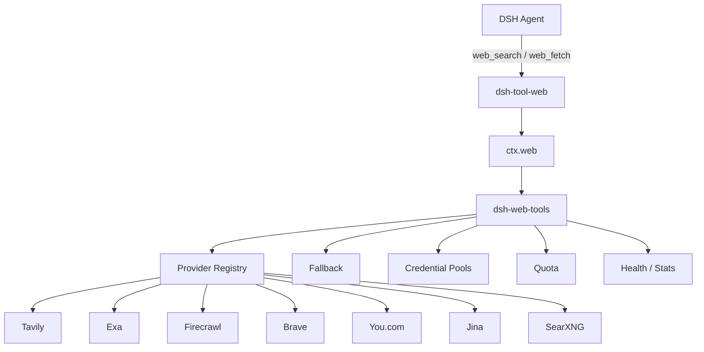
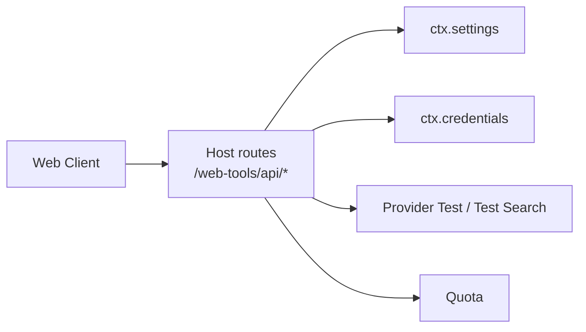

<div align="center">

<p align="center">
  
</p>

# dsh-web-tools

DeepSeek Harness 的多搜索源 Web Provider 插件。

同时配置 Tavily、Exa、Firecrawl、Brave、You.com、Jina 和 SearXNG，并为它们设置搜索顺序。当前 Provider 限流、认证失败、超时或不可用时，插件可以继续尝试后面的 Provider。

Agent 侧仍然使用 DSH 原有的 `web_search` 和 `web_fetch`。

[](LICENSE)
[](CONTRIBUTING.md)
[](https://github.com/deepseek-ai/deepseek-harness)

[English](README.md) | **简体中文**

</div>

<!-- 建议这里直接放真实设置页截图 -->
<!--  -->

## 功能

- Tavily、Exa、Firecrawl、Brave、You.com、Jina、SearXNG
- 自定义搜索优先级和 fallback
- 每个 Provider 支持多个 API Key
- Provider / Credential 健康状态
- 上游支持时显示余额、额度或 Rate Limit
- Tavily、Exa、Firecrawl、Jina 支持网页正文获取
- SearXNG 自托管
- DSH Web 设置页
- Provider 连接测试和 Test Search
- API Key 使用 DSH Credentials 保存

插件不提供代理服务器或共享 Key。请求从本机 DSH Host 直接发送给配置的 Provider。

## 安装

目前针对 DeepSeek Harness `0.1.0-rc.6` 的 `web` profile 开发和测试。

```bash
dsh plugin --profile web add github:A3Boy/dsh-web-tools
```

重启 `dsh web` 后，打开：

```text
Settings → Plugins → Plugin configuration → dsh-web-tools
```

检查插件是否进入当前 profile：

```bash
dsh --profile web --dump-config
```

更新或移除：

```bash
dsh plugin --profile web update dsh-web-tools
dsh plugin --profile web remove dsh-web-tools
```

插件通过 DSH Profile Bundle 加载，不需要修改 Harness 源码。

## Provider

| Provider | Search | Fetch | 主要特点 |
| --- | :---: | :---: | --- |
| [Tavily](https://tavily.com) | ✅ | ✅ | 面向 Agent / RAG 的搜索与正文提取 |
| [Exa](https://exa.ai) | ✅ | ✅ | 语义搜索、网页内容和 highlights |
| [Firecrawl](https://firecrawl.dev) | ✅ | ✅ | Search + Scrape，适合继续读取网页 |
| [Brave Search](https://brave.com/search/api/) | ✅ | — | 独立 Web 搜索索引 |
| [You.com](https://you.com) | ✅ | — | Web / News Search |
| [Jina](https://jina.ai) | ✅ | ✅ | Search + Reader |
| [SearXNG](https://docs.searxng.org) | ✅ | — | 自托管 Meta Search |

简单选型：

| 需求 | 可以先试 |
| --- | --- |
| 普通 Agent 搜索 | Tavily |
| 语义检索、技术研究 | Exa |
| 搜索后继续抓正文 | Firecrawl / Jina |
| 常规 Web 搜索 | Brave |
| Web / News | You.com |
| 自己部署 | SearXNG |

<details>
<summary><strong>免费额度与价格参考</strong>（2026-08-16）</summary>

这里仅作为选型参考，上游可能随时调整价格和免费计划。

| Provider | 当前免费额度 | 备注 |
| --- | --- | --- |
| Tavily | 1,000 credits / 月 | Basic Search = 1 credit |
| Exa | 注册 $20 credits，之后 $10 / 月 | Search 当前 $7 / 1k requests |
| Firecrawl | 1,000 credits / 月 | Search = 2 credits / 10 results |
| Brave | $5 credits / 月 | Search 当前 $5 / 1k requests |
| You.com | 新账号 $100 credits | 官网当前另列 Search 100 calls/day free |
| Jina | 新 API Key 10M tokens | `s.jina.ai` 按 token 消耗 |
| SearXNG | 无平台额度 | 成本取决于自己的实例和上游 |

</details>

## 搜索顺序

设置页直接维护一个有序列表：

```text
1. Tavily        Default
2. Exa
3. Brave
4. SearXNG
```

第一项是默认 Provider，后面的 Provider 按顺序用于 fallback。

Provider 可以：

- 上移 / 下移
- 加入搜索链
- 从搜索链移除
- 单独启用或禁用

“从搜索链移除”和“禁用 Provider”是两件事。一个已配置的 Provider 可以保留用于测试，而不参与自动 fallback。

例如：

```text
Tavily
  ↓ 429
Exa
  ↓ timeout
Brave
  ↓
success
```

当前会继续尝试下一 Provider 的错误包括：

```text
401 / 403
408
429
5xx
network error
timeout
provider unavailable
```

认证失败时会先尝试当前 Provider 的下一把健康 Key；该 Provider 已没有可用 Key 时再进入下一 Provider。

`400 bad request` 和本地配置错误不会 fallback

调用方主动取消请求时，整个链立即终止，也不会继续请求下一 Provider。

## 多 Key

每个 Provider 可以配置多个 API Key：

```text
Tavily
├── Key A
├── Key B
└── Key C
```

Key 使用 least-used-first：

1. 从健康的 Key 中选择调用次数最少的一把。
2. 次数相同时按配置顺序选择。
3. `401 / 403` 会把当前 Key 标记为不可用，并尝试下一把 Key。
4. `429 / 5xx / network / timeout` 不会把 Key 判定为失效，而是直接进入下一 Provider。
5. Key 的健康状态会一直保留到凭据配置发生变化。

多个 Key 可以使用逗号、空格、换行或分号分隔。

这个功能用于团队凭据、不同 Workspace、Key rollover 和环境隔离等正常场景，请遵守各 Provider 的账户和配额规则。

## 额度

Provider 对额度的定义并不统一：

```text
Tavily      credits
Firecrawl   credits
Brave       requests
You.com     USD
Jina        tokens
SearXNG     self-hosted
```

插件保留上游自己的单位，不统一换算成百分比。

| Provider | 数据来源 | 状态 |
| --- | --- | --- |
| Tavily | 官方 `/usage` | ✅ |
| Firecrawl | 官方 `/v2/team/credit-usage` | ✅ |
| You.com | 官方 Account Balance API | ✅ |
| Brave | `X-RateLimit-*` 响应头 | ✅ |
| Exa | 无普通 Search Key 可用的公开余额接口 | 本地估算 |
| Jina | Reader 返回的余额信息 | Best-effort |
| SearXNG | 无平台额度 | Self-hosted |

Quota 分为权威数据和 best-effort 数据，只用于设置页展示。

当前搜索 fallback 以真实请求结果为准，例如 `402`、`429` 或其他 Provider 错误；Quota 查询失败不会影响搜索。

对于多 Key Provider，当前额度面板只查询第一把 Key，并在 UI 中标明这一点。

Quota 结果缓存 5 分钟，不做后台轮询。

## 网页读取

典型调用过程：

```text
web_search
    ↓
候选 URL
    ↓
web_fetch
    ↓
正文
```

Tavily、Exa、Firecrawl 和 Jina 使用各自的正文提取接口。

`web_fetch` 会按照同一搜索优先级，寻找下一个支持 Fetch 的 Provider，但它不会绑定到上一次 `web_search` 实际命中的 Provider。

例如搜索由 Brave 完成：

```text
Brave Search
    ↓
URL
    ↓
Tavily / Exa / Firecrawl / Jina Fetch
```

这里需要注意一个语义差异：这些 Provider 的 Extract / Reader 接口主要返回正文，因此插件目前不能保证 `web_fetch` 返回目标 URL 的真实 HTTP status、最终重定向地址等信息。

如果任务需要严格的 HTTP Fetch 语义，可以使用 DSH 自带的 HTTP Fetch，把本插件的 Fetch 当作正文提取能力。

## 设置

配置入口：

```text
Settings → Plugins → Plugin configuration → dsh-web-tools
```

目前可以管理：

- 插件启用状态
- 搜索优先级
- 单 Provider 超时
- Provider 启用 / 禁用
- API Key / 多 Key
- 自定义 Base URL
- Provider 连接测试
- Quota
- Test Search

Test Search 会实际发出一次搜索，并显示命中的 Provider、延迟和返回结果。

搜索结果数量仍由 DSH `web_search` 工具层控制。

DSH 也负责一次完整 `web_search` 的总超时；这里配置的是单个 Provider 一次尝试最多等待多久。

<!--
建议正式发布前补：


-->

## SearXNG

SearXNG 可以和其他 Provider 一样放进搜索顺序：

```text
Tavily → Exa → Brave → SearXNG
```

也可以只配置 SearXNG。

SearXNG 本身没有云端 API 额度，不过实际搜索是否稳定仍取决于自己的实例、网络和启用的上游搜索引擎。

## 安全

- API Key 只在 DSH Host 侧解析。
- 完整凭据不会返回给 Web Client。
- 前端只拿到配置状态或掩码后的凭据信息。
- 测试结果和日志不会返回完整 API Key。
- 配置写操作限制在本地配置平面。
- 请求不经过本项目维护的中转服务器。
- 插件不上传 Search usage telemetry。
- 可以只使用自托管 SearXNG。

## 兼容性和已知限制

- 当前针对 DeepSeek Harness `0.1.0-rc.6` 开发和测试。DSH 仍处于 developer preview，未来版本可能需要适配。
- Provider 原生 Extract / Reader 不等价于严格的 HTTP Fetch。
- SearXNG 的结果和稳定性取决于实例本身以及启用的上游引擎。
- Provider 免费额度和价格不是本项目 API 的一部分，可能随上游调整。
- 多 Key Provider 的额度面板目前只展示第一把 Key 的额度。

## 架构



Web 设置页通过本地 Host routes 读写插件配置：



Provider 选择和 fallback 在插件内部完成，不需要额外 LLM 请求，也不会为每个 Provider 注册一套模型工具。

## 验证

| 项目 | 状态 |
| --- | --- |
| TypeScript / Build | ✅ |
| Pool / fallback / Jina / Brave header 单元测试 | ✅ |
| Config / credential / quota / loopback routes smoke | ✅ |
| Abort / timeout / auth / multi-key runtime invariants | ✅ |
| Tavily Search + Quota | ✅ E2E |
| Exa Search + 多 Key | ✅ E2E |
| Firecrawl Search + Fetch + Quota | ✅ E2E |
| Brave / You.com / Jina / SearXNG | Adapter ready，E2E 待补 |

运行：

```bash
npm install
npm test
```

单独执行类型检查和构建：

```bash
npx tsc -p tsconfig.json --noEmit
npx tsc -p tsconfig.client.json --noEmit
npx tsc -p tsconfig.build.json
```

## Provider 开发

Provider Adapter 位于：

```text
src/host/providers/
```

新增 Provider 实现 `ProviderAdapter` 并在 registry 注册。

如果该 Provider 还支持正文读取或额度接口，可以同时实现 Fetch / Quota。

具体约定见 [CONTRIBUTING.md](CONTRIBUTING.md)。

## Roadmap

- Serper
- Parallel
- Perplexity
- 更多 Provider E2E
- Provider 搜索结果对比
- 用量历史
- 评估是否让 `web_fetch` 回归 DSH HTTP Fetch 语义

## 让编码 Agent 安装

<details>
<summary>安装提示词</summary>

```text
安装 dsh-web-tools：

https://github.com/A3Boy/dsh-web-tools

要求：
- 使用当前 DSH profile 的标准 plugin 安装方式。
- 不要读取或打印 API Key。
- 不要修改 DeepSeek Harness core。
- 安装后执行 `dsh --profile web --dump-config` 检查配置。
- 未经询问不要终止或重启现有 DSH 进程。
- 最后告诉我插件是否已经进入 web profile。
```

</details>

## Contributing

Issue 和 PR 都欢迎。

新增 Provider 前建议先看现有 Adapter 和 [CONTRIBUTING.md](CONTRIBUTING.md)，避免给 Agent 增加 Provider 专属 Tool。

## License

[MIT](LICENSE) © A3Boy
