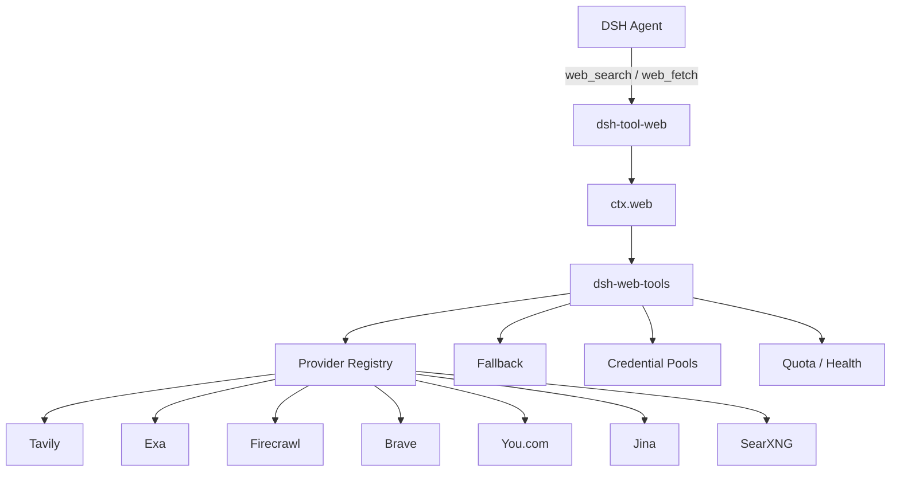
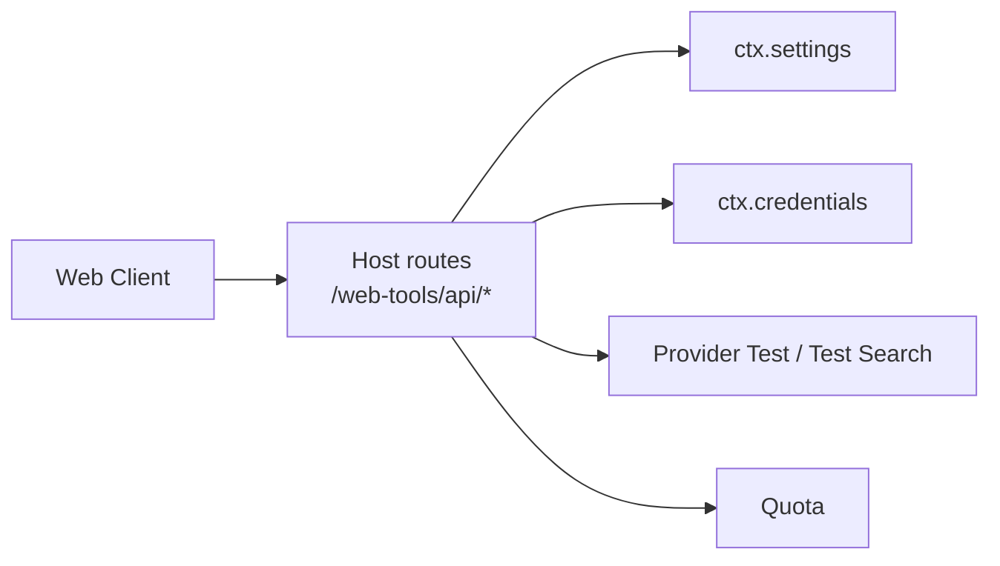

<div align="center">

<p align="center">
  
</p>

# dsh-web-tools

DeepSeek Harness 的多搜索源 Web Search / Fetch Provider 插件。

同时配置 Tavily、Exa、Firecrawl、Brave、You.com、Jina 和 SearXNG，并维护一条搜索顺序。某个 Provider 限流、超时、认证失败或不可用时，插件可以继续尝试下一家。

Agent 侧仍然使用 DSH 原生的 `web_search` / `web_fetch`，不新增模型工具。

<p align="center">
  <a href="https://github.com/A3Boy/dsh-web-tools/stargazers">
    
  </a>
  <a href="LICENSE">
    
  </a>
  <a href="https://github.com/deepseek-ai/deepseek-harness">
    
  </a>
  
</p>

<p align="center">
  
  
  
  
  
  
</p>

[English](README.md) | **简体中文**

</div>

<p align="center">
  
</p>

## 功能

- Tavily、Exa、Firecrawl、Brave、You.com、Jina、SearXNG
- 自定义搜索顺序和 fallback
- Provider 独立启用 / 禁用
- 每个 Provider 支持多个 API Key
- Provider / Credential 健康状态
- 上游支持时显示余额、额度或 Rate Limit
- Tavily、Exa、Firecrawl、Jina 支持网页正文读取
- SearXNG 自托管
- Provider 连接测试
- Test Search：真实执行搜索并展示命中 Provider、耗时、fallback 过程和搜索结果
- API Key 使用 DSH Credentials 保存

插件不提供代理服务器或共享 Key。请求由本地 DSH Host 直接发送给对应 Provider。

## 安装

当前针对 DeepSeek Harness `0.1.0-rc.6` 的 `web` profile 开发和测试。

```bash
dsh plugin --profile web add github:A3Boy/dsh-web-tools
```

重启 `dsh web` 后打开：

```text
Settings → Web Search
```

检查插件是否进入当前 profile：

```bash
dsh --profile web --dump-config
```

更新：

```bash
dsh plugin --profile web update dsh-web-tools
```

移除：

```bash
dsh plugin --profile web remove dsh-web-tools
```

插件通过 DSH Profile Bundle 加载，不需要修改 Harness 源码。

## 网络与代理

Node 的全局 `fetch` 默认**不读取系统代理**。插件会按以下顺序使用代理：

1. `HTTPS_PROXY` / `HTTP_PROXY` 环境变量
2. Windows 系统代理（注册表）——DSH 从 GUI 启动、没有环境变量时也能用上代理

规则：

- `localhost` / `127.0.0.1` / `::1` / `*.local`（如本机 SearXNG）**永不**走代理
- `NO_PROXY` 中的精确主机、`.后缀` 域名、`<local>` 会绕过代理
- 如果配置了代理但未安装 `undici`（依赖缺失，通常出现在插件链接早于依赖声明的 profile），请求会**降级为直连**，设置页顶部会显示"代理不可用"提示，此时依赖代理的 Provider 可能超时——在 profile 目录运行 `pnpm install` 后重启即可

## Providers

| Provider | Search | Fetch | 说明 |
| --- | :---: | :---: | --- |
| [Tavily](https://tavily.com) | ✅ | ✅ | Agent / RAG 搜索与正文提取 |
| [Exa](https://exa.ai) | ✅ | ✅ | Semantic / neural search、highlights |
| [Firecrawl](https://firecrawl.dev) | ✅ | ✅ | Search + Scrape |
| [Brave Search](https://brave.com/search/api/) | ✅ | — | 独立 Web 搜索索引 |
| [You.com](https://you.com) | ✅ | — | Web / News Search |
| [Jina](https://jina.ai) | ✅ | ✅ | Search + Reader |
| [SearXNG](https://docs.searxng.org) | ✅ | — | 自托管 Meta Search |

<p align="center">
  
</p>

简单选型：

| 需求 | 可以先试 |
| --- | --- |
| 普通 Agent 搜索 | Tavily |
| 语义检索、技术研究 | Exa |
| 搜索后继续抓正文 | Firecrawl / Jina |
| 常规 Web 搜索 | Brave |
| Web / News | You.com |
| 自托管 | SearXNG |

<details>
<summary><strong>免费额度参考</strong></summary>

上游价格和免费计划可能随时调整，以下仅作为选型参考。

| Provider | 当前免费入口 | 备注 |
| --- | --- | --- |
| Tavily | 1,000 credits / 月 | 免费计划可直接使用 |
| Exa | 注册赠送 credits + Free Tier | 普通个人 Search Key 没有公开余额查询 API |
| Firecrawl | 1,000 credits / 月 | 免费计划可直接使用 |
| Brave | 每月包含免费 credits | 需要 Search subscription 和 payment method |
| You.com | 新账号 API credits | 具体额度以上游 Dashboard 为准 |
| Jina | 新 API Key 提供免费 tokens | 按 token 消耗 |
| SearXNG | 无平台额度 | 取决于自己的实例和上游 |

Brave 的 `Search`、`Answers`、`Autosuggest`、`Spellcheck` 是不同 API 产品。

本插件调用 Web Search endpoint，因此 Brave Key 必须属于 **Search subscription**。

</details>

## 搜索顺序与 fallback

设置页维护一条有序 Provider 链，第一项就是默认 Provider：

```text
Tavily → Firecrawl → Exa
```

搜索链中的 Provider 可以直接拖动排序。

“启用 Provider”和“加入搜索链”是两件事：一个已经配置的 Provider 可以保持启用，用于单独测试，但不参与自动 fallback。

当前失败处理：

```text
401 / 403
→ 当前 Key 标记为不可用
→ 尝试同 Provider 的下一把健康 Key

408 / 429 / 5xx / network / timeout
→ 进入下一 Provider

400 / 本地配置错误
→ 不 fallback

caller abort
→ 立即终止整个搜索链
```

真实 fallback：

<p align="center">
  
</p>

上图中第一个 Provider 超时后，搜索继续由下一 Provider 完成。

Provider 选择和 fallback 都是确定性的，不需要额外调用 LLM。

## 多 API Key

每个 Provider 可以保存多把 API Key：

```text
Tavily
├── Key A
├── Key B
└── Key C
```

Key 池使用 least-used-first：

1. 从健康 Key 中选择调用次数最少的一把。
2. 次数相同时按配置顺序选择。
3. `401 / 403` 会将当前 Key 标记为 unhealthy，并尝试同 Provider 的下一把健康 Key。
4. `429 / 5xx / network / timeout` 不会把 Key 判定为失效，而是进入下一 Provider。
5. Key 的健康状态保持到 Credential 配置发生变化。

完整 API Key 不返回给 Web Client，前端只显示掩码后的凭据信息。

多 Key 功能用于团队凭据、不同 Workspace、Key rollover、环境隔离等正常场景，请遵守各 Provider 的账户和额度规则。

## Quota / Usage

不同 Provider 的额度单位和查询方式并不相同：

```text
Tavily      credits
Firecrawl   credits
Brave       requests
You.com     USD
Jina        tokens
SearXNG     self-hosted
```

当前数据来源：

| Provider | 数据来源 | 状态 |
| --- | --- | --- |
| Tavily | 官方 `/usage` | ✅ |
| Firecrawl | 官方 `/v2/team/credit-usage` | ✅ |
| You.com | 官方 Account Balance API（`X-API-Key`） | ✅ |
| Brave | `X-RateLimit-*` Search 响应头（持久化） | ✅ |
| Exa | 普通 Search Key 无公开余额接口 | Dashboard / unavailable |
| Jina | Reader 可获得的信息 | Best-effort |
| SearXNG | 自托管 | 无平台额度 |

设置页只有在真实存在 `remaining + limit` 时才显示进度条。

不会因为某个 Provider 官网写着“注册送 1000 credits”，就直接假设：

```text
1000 - 本地调用量 = 账户剩余额度
```

因为同一 API Key 可能还被其他客户端使用，也可能存在充值、赠送额度或额度调整。

对于支持额度查询的多 Key Provider，插件会逐把查询并合并为池总额。

例如两把 Tavily Key：

```text
Key A: 950 / 1000
Key B: 982 / 1000

Pool: 1932 / 2000 credits
```

额度会在后台静默刷新：插件每隔 5 分钟自动更新一次额度缓存，不需要打开设置页，重启后也会在启动后很快拉取到最新数据。

Brave 比较特殊：它没有独立的额度查询接口，额度只出现在真实 Search 请求的响应头（`X-RateLimit-*`）。插件在每次搜索时捕获这些响应头，并**持久化到设置**，因此重启后仍能显示上次的剩余额度（显示"剩余 requests + 更新时间"），直到下一次搜索更新。

Quota 主要用于设置页展示。实际 fallback 仍以真实 Search 请求返回的错误为准。

## Test Search

设置页可以直接执行一次真实搜索，并展示：

- 实际命中的 Provider
- 总耗时
- 每次 Provider attempt
- success / timeout / auth / rate-limit
- 返回的搜索结果

<p align="center">
  
</p>

搜索结果数量仍由 DSH `web_search` 工具层控制。

DSH 负责一次完整 `web_search` 的总超时；插件设置的 timeout 只限制单个 Provider attempt。

## 网页读取

典型调用过程：

```text
web_search
    ↓
候选 URL
    ↓
web_fetch
    ↓
正文
```

Tavily、Exa、Firecrawl 和 Jina 使用各自的正文提取接口。

`web_fetch` 会沿着同一 Provider 顺序寻找支持 Fetch 的下一家，但不会绑定到上一次 `web_search` 实际命中的 Provider。

例如：

```text
Brave Search
    ↓
URL
    ↓
Tavily / Exa / Firecrawl / Jina Fetch
```

这些 Provider 的 Extract / Reader API 主要返回正文，因此插件不能保证提供目标 URL 的真实 HTTP status、最终重定向 URL 等严格 HTTP Fetch 元数据。

如果任务需要严格 HTTP Fetch 语义，可以使用 DSH 自带的 HTTP Fetch。

## SearXNG

SearXNG 不需要 API Key。

在 Provider 弹窗填写实例 Base URL 后即可加入搜索链：

```text
Tavily → Firecrawl → Exa → SearXNG
```

也可以只使用 SearXNG。

SearXNG 本身没有平台额度；实际搜索质量、稳定性和限流取决于自己的实例、网络和启用的上游搜索引擎。

## 安全

- API Key 只在 DSH Host 侧解析
- 完整 Credential 不返回给 Web Client
- 前端只显示掩码后的凭据和状态
- 测试结果与日志不输出完整 API Key
- 请求不经过本项目维护的中转服务器
- 插件不上传 Search usage telemetry
- 可以只配置自托管 SearXNG

## 兼容性与已知限制

- 当前针对 DeepSeek Harness `0.1.0-rc.6` 开发和测试
- DSH 仍处于 developer preview，未来版本可能需要适配
- Provider 原生 Extract / Reader 不等价于严格 HTTP Fetch
- Exa 普通个人 Search Key 没有公开余额 API
- Brave Search 需要 Search subscription 对应的 API Key
- SearXNG 的结果质量和稳定性取决于实例与上游搜索引擎
- Provider 免费额度和价格由上游控制，可能调整

## 架构



Web 设置页通过本地 Host routes 读写插件配置：



Provider 选择和 fallback 都在插件内部完成，不为每个 Provider 注册独立的模型可见工具。

## 验证

| 项目 | 状态 |
| --- | --- |
| TypeScript / Build | ✅ |
| Pool / fallback / Provider adapter 单元测试 | ✅ |
| Config / credential / quota / loopback routes smoke | ✅ |
| Abort / timeout / auth / multi-key runtime invariants | ✅ |
| Tavily Search + Quota | ✅ E2E |
| Exa Search + 多 Key | ✅ E2E |
| Firecrawl Search + Fetch + Quota | ✅ E2E |
| You.com Search + Quota（X-API-Key） | ✅ E2E |
| Brave / Jina / SearXNG | Adapter ready，继续补 E2E |

运行测试：

```bash
npm install
npm test
```

类型检查和构建：

```bash
npx tsc -p tsconfig.json --noEmit
npx tsc -p tsconfig.client.json --noEmit
npx tsc -p tsconfig.build.json
npm run build
```

仓库会提交编译后的 `lib/`，保证 DSH 从 git 安装插件时已经包含可加载的 bundle。

## Provider 开发

Provider Adapter 位于：

```text
src/host/providers/
```

新增 Provider 需要实现 `ProviderAdapter` 并在 Provider registry 注册。

如果 Provider 同时提供正文读取或额度查询，可以补充 Fetch / Quota 实现。

具体约定见 [CONTRIBUTING.md](CONTRIBUTING.md)。

## Roadmap

- Serper
- Parallel
- Perplexity
- 更多 Provider E2E
- Provider 搜索结果对比
- Usage history
- 继续评估 `web_fetch` 与 DSH HTTP Fetch 的职责边界

## 让编码 Agent 安装

<details>
<summary>安装提示词</summary>

```text
Install dsh-web-tools:

https://github.com/A3Boy/dsh-web-tools

Requirements:
- Use the standard plugin installation flow for the current DSH profile.
- Do not read or print API keys.
- Do not modify DeepSeek Harness core.
- After installation, run `dsh --profile web --dump-config` to verify the profile.
- Do not terminate or restart an existing DSH process without asking me first.
- Report whether the plugin is present in the web profile.
```

</details>

## Contributing

Issues 和 Pull Requests 都欢迎。

新增 Provider 前请先阅读现有 Adapter 和 [CONTRIBUTING.md](CONTRIBUTING.md)。

## License

[MIT](LICENSE) © A3Boy
